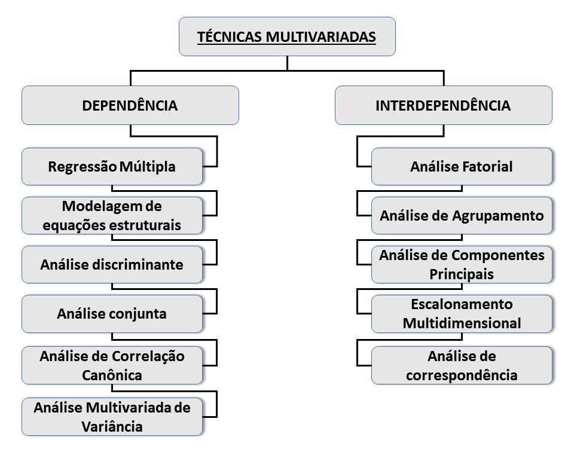
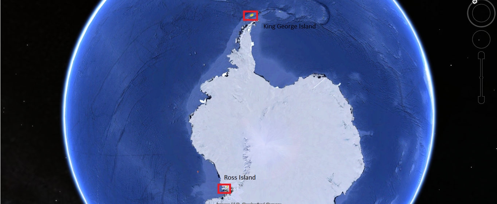

# 1. Introdução

Classificação das técnicas multivariadas (Dependências e Interdependência)

# 2. Entrada dos dados

Dados contém informações sobre a emissão de $CO_2$ do solo (Rs - respiração do solo) em diferentes regiões da Antártica marítima, os objetivos iniciais eram caracterizar a Rs e sua relação com alguns atributos como a temperatura, a umidade e o teor de carbono do orgânico solo dessas regiões.

Rs é uma importante  variável do ciclo do carbono desse ecossitema, pois a camada de gelos está diminuindo devido às mudanças climáticas e os solos estão sendo expostos.

Os dados são oriundos de esforços conjuntos entre as UNESP-UFV e parcerias internacionais, porém, ainda não foram publicados, assim, serão fornecidos parte do banco de dados original com os valores já padronizados.

