# 1. Introdução

Classificação das técnicas multivariadas (Dependências e Interdependência)

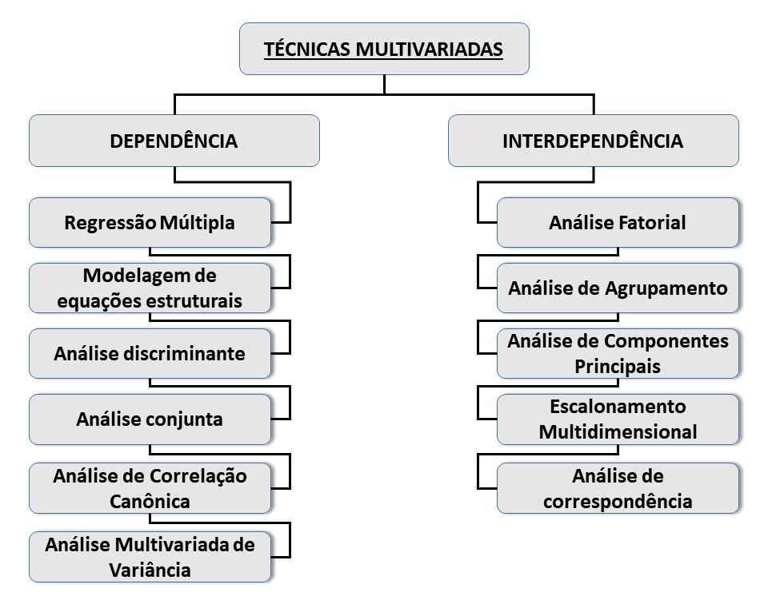

# 2. Por que Utilizar o R.

    

R é um ambiente e linguagem de programação de código aberto para computação estatística, bioinformática e gráficos.

  * Como linguagem de programação, garante a reprodutibilidade das análises.
  
    + Estudantes podem usar as mesmas ferramentas que os profissionais.

    + Todos podem usar as melhores ferramentas independente do poder financeiro.

    + Qualquer um pode reproduzir as suas análises.

    + Você pode corrigir problemas.

    + Você pode desenvolver suas próprias ferramentas.

  * Linguagem orientada a objetos R  (Ross Ihaka e Robert Gentleman).

  * R é uma poderosa linguagem, flexível e possui excelentes facilidades gráficas.

  * R é um projeto **open-source** e está disponível na internet sobre a General Public License (<www.gnu.org/copyleft/gpl.html> e <www.fsf.org>).


# 4. Instalando e Ambientação do R e do RStudio


### 4.1. Instalando o R

Faça o donwload do R do site oficial The R Project for Statistical Computing <https://www.r-project.org/>

ou

Acesso rápido: [Download](<https://cran-r.c3sl.ufpr.br/bin/windows/base/R-4.0.3-win.exe>)


Salve o arquivo de instalação em um diretório de seu computador e em seguida execute-o. 

O processo é simples e intuitivo.

### 4.2. Instalando o RStudio

É um ambiente de desenvolvimento integrado (IDE) para o R, disponível em <https://rstudio.com/products/rstudio/download/>

Escolha o instalador gratuito, de acordo com o seu sistema operacional.

Novamente, salve o arquivo de instalação em um diretório de seu computador e em seguida execute-o.

Após a instalação procure o ícone do RStudio criado pelo instalador e clique nele.


Um breve tutorial para instalação do R e do RStudio pode ser encontrado no vídeo abaixo.

<iframe width="560" height="315" src="https://www.youtube.com/embed/AqTzQzuQUPw" frameborder="0" allow="accelerometer; autoplay; clipboard-write; encrypted-media; gyroscope; picture-in-picture" allowfullscreen></iframe>


# 5. Pacotes no R (instalação dos pacotes)

Um pacote é uma coleção de funções, exemplos e documentação. A funcionalidade de um pacote é frequentemente focada em uma metodologia estatística especial" (**Everitt & Hothorn**).

 

Liste os pacotes carregados no ambiente com:

```{r}
(.packages())
```

Carregue um pacote, utilize a função `library`.

```{r,message=FALSE}
library(tidyverse)
```

Agora, liste novamente os pacotes e observe a diferença no retorno da função.

```{r}
(.packages())
```


**Utilizando a opção** `Install/Packages`

Instale alguns pacotes:  
 
 * `tidyverse`
 * `lattice`  
 * `plotrix`  
 * `readxl`
 * `corrplot`
 * `vegan`


# 5. Entrada dos dados

Dados contém informações sobre a emissão de $CO_2$ do solo (Rs - respiração do solo) em diferentes regiões da Antártica marítima, os objetivos iniciais eram caracterizar a Rs e sua relação com alguns atributos como a temperatura, a umidade e o teor de carbono do orgânico solo dessas regiões.

Rs é uma importante  variável do ciclo do carbono desse ecossitema, pois a camada de gelos está diminuindo devido às mudanças climáticas e os solos estão sendo expostos.

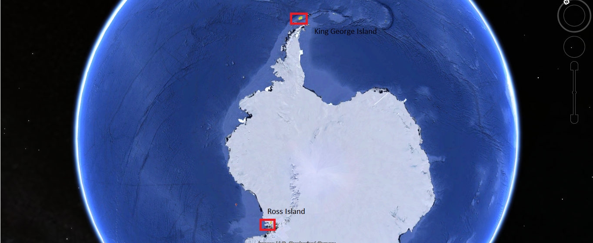

Os dados são oriundos de esforços conjuntos entre as UNESP-UFV e parcerias internacionais, porém, ainda não foram publicados, assim, serão fornecidos parte do banco de dados original com os valores já padronizados.


### 5.1. Importação da tabela de dados da web.

Os dados estão disponíveis online no link abaixo:

<https://github.com/arpanosso/palestra_PPGA_feis/blob/main/dados/dadosr.txt>

```{r}
# Entrada
caminho<-"https://raw.githubusercontent.com/arpanosso/palestra_PPGA_feis/main/dados/dadosr.txt"
dados<-read.table(file = caminho, # caminho do arquivo na internet 
                  header = TRUE, # cabeçalho na primeira linha do arquivo
                  sep = "\t") # separação entre as colunas é uma tabulação "\t"

# Verificação dos dados
head(dados)
```


### 5.2. Importação da tabela a partir de um diretório do computador.

```{r}
# Importa a tabela de dados de um diretório do computados
dados<-read.table(file="c://r//datasr.txt",header=T,sep="\t")
head(dados)
```

# 6. Carregando os pacotes

Para esse exemplo prático vamos utilizar os pacotes `tidyverse`, `vegan`, `corrplot` e `plotrix`.

```{r, message=FALSE}
library("tidyverse")
library("vegan")
library("corrplot")
library("lattice")
library("plotrix")
```

# 7. Conhecendo a estrutura dos dados

```{r}
glimpse(dados)
```


Atributos do solo (variáveis).

  * $Rs$ - Respiração do solo;  
  * $Ms$ - Umidade do solo;  
  * $Ts$ - Temperatura do solo;  
  * $CN$ - Relação C:N;  
  * $TOC$ - Carbono orgânico total;  
  * $pH$ - potencial hidrogeniônico.  

**Sítios experimentais** - Ilha de Rei George – imediações das estações Eduardo Frei (Chilena), Comandantes Ferraz (Brasileira) e Arctowski (Polonesa).

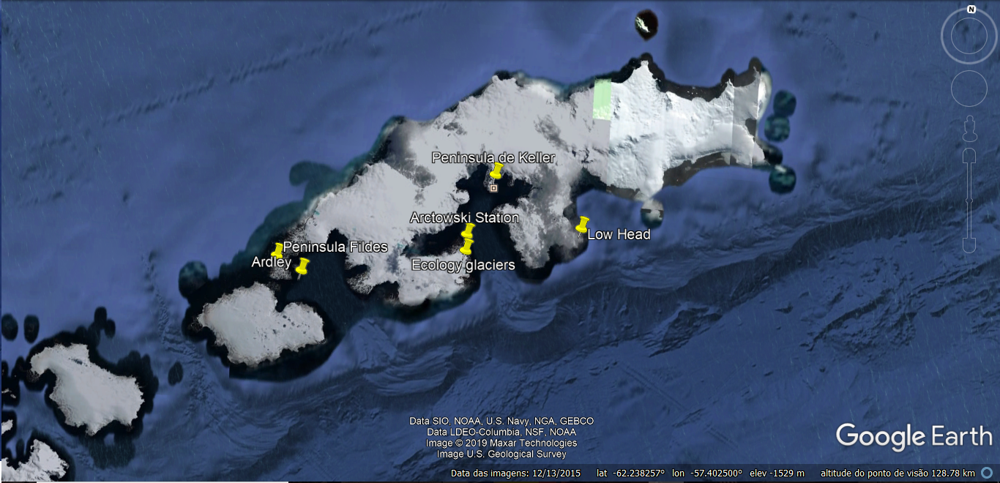

Área de recúdo de geleira - Low Head. Fonte: Thomazini et al. (2015)

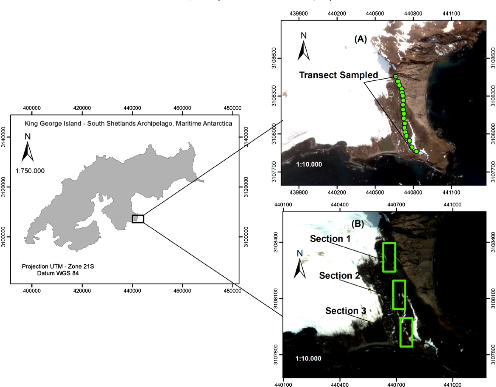
**Sítios experimentais** - Ilha de Ross – imediações da estação McMurdo (Norte Americana)

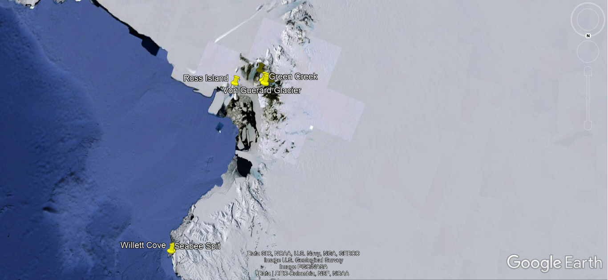

Sistema LI-8100 (LICOR) câmara de solos para determinação de Rs e aspéctos gerais de um sítio experimental. Fonte: Arquivo pessoal.

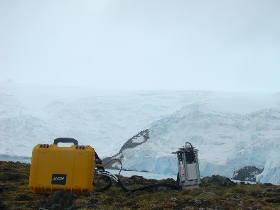 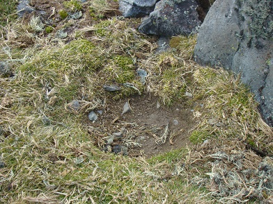 

#### Cobertura vegetal - algumas espécies


**a)** *Deschampsia antarctica*;  **b)** *Sanionia uncianata*; **c)**  No vegetation; **d)**  *Usnea* sp.; **e)**  *Chorisodontium aciphyllu*; **f)** *Colobanthus quitensis*.

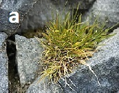 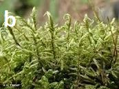 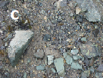

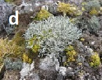 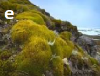 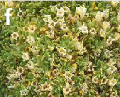


#### Cobertura vegetal (plantCoverage).          
  *    D.antarctica    -    Deschampsia antarctica;  
  *    S.uncianata    -    Sannionia uncianata;  
  *    NV    -    No vegetation;  
  *    Us    -    Usnea sp.;  
  *    Chorisodontium aciphyllum      -    C.aciphylum;   
  *   Colobanthus quitensis    -    C.quitensis;  
  *    Drepanocladus uncinatus    -    D.uncinatus;  
  *    Nostoc comminutum    -    N.comminutum;  
  *    Calliergon sarmentosum    -    C.sarmentosum;   
  *    Bry    -    Bryum sp.;  
  *    B_austro_salebrosum    -    Brachythecium austro-salebrosum.

#### Classificação dos solos (soilType - USDA classification).   
  * LTC-Leptic Thimorphic Cryosol  
  * THCgp-Turbi-Histic Cryosol, affected by guano of penguins;  
  * THC-Turbi-Histic Cryosol;  
  * TCC-Turbic Cambic Cryosol;   
  * LC-Leptic Cryosol;  
  * TC-Turbic Cryosol;  
  * HR-Haplic Regosol;  
  * AC-Andic Cambisol;  
  * OCgp-Ornithogenic Cryosol, strongly affected by penguins;  
  * Cseal-Cryosol, strongly affected by seals.  

#### Influência da fauna local - Pinguineiras

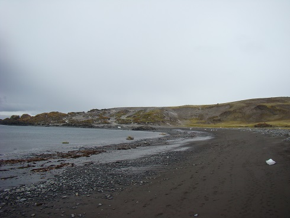 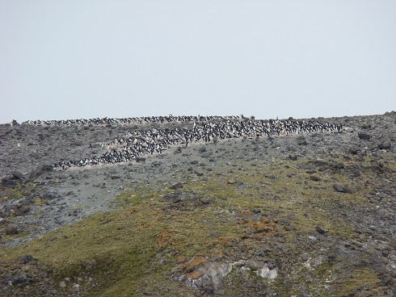 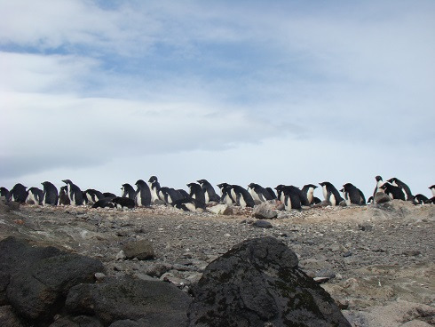 

Fonte: Arquivo Pessoal


# 7. Visualização dos dados

```{r}
dados %>% 
  group_by(soilType) %>% 
  count(soilType) %>% 
  ggplot(aes(x=soilType,y=n)) +
  geom_col(fill="aquamarine4",col="black") +
  coord_flip() + theme_minimal()+
  labs(x="Tipo de Solo", y= "n")
```


```{r}
dados %>% 
  group_by(plantCoverage) %>% 
  count(plantCoverage) %>% 
  ggplot(aes(x=plantCoverage,y=n)) +
  geom_col(fill="orange",col="black") +
  coord_flip() + theme_minimal()+
  labs(x="Cobertura Vegetal", y= "n")
```

```{r}
dados %>% 
  group_by(region) %>% 
  count(region) %>% 
  ggplot(aes(x=region,y=n)) +
  geom_col(fill="salmon",col="black") +
  coord_flip() + theme_minimal()+
  labs(x="Sítio experimental", y= "n")
```

```{r}
dados %>% 
  group_by(soilType) %>% 
  count(soilType) %>% 
  ggplot(aes(x=soilType,y=n,fill=as.factor(soilType))) +
  geom_col() +
  coord_flip() + theme_minimal()+
  labs(x="Tipo de Solo", y= "n",fill="Tipo de Solo")
```

```{r}
dados %>% 
  group_by(soilType,plantCoverage) %>% 
  count(soilType) %>% 
  ggplot(aes(x=soilType,y=n,fill=as.factor(plantCoverage))) +
  geom_col() +
  coord_flip() + theme_minimal()+
  labs(x="Tipo de Solo", y= "n",fill="Cobertura vegetal")
```
```{r}
dados %>% 
  group_by(soilType,plantCoverage) %>% 
  count(soilType) %>% 
  ggplot(aes(x=soilType,y=n,fill=as.factor(plantCoverage))) +
  geom_col(position = "dodge") +
  theme_minimal()+
  coord_flip() +
  labs(x="Tipo de Solo", y= "n",fill="Cobertura vegetal")
```

```{r}
dados %>% 
  ggplot(aes(x=Rs))+
  geom_histogram(aes(y=..density..),color="black",fill="white",bins=30)+
  geom_density(alpha=.15,fill="salmon")+
  geom_vline(aes(xintercept=mean(Rs)),color="blue",size=1,linetype="dashed")
```

```{r}
dados %>% 
  ggplot(aes(x=Rs))+
  geom_boxplot(col="blue",lty=2,fill="orange") 
```


```{r}
dados %>% 
  group_by(soilType) %>% 
  ggplot(aes(x=soilType,y=Rs,fill=as.factor(soilType)))+
  geom_boxplot(col="black") +
  labs(x="Tipo de Solo", y= "Rs",fill="Tipo de Solo")
```

```{r}
dados %>% 
  ggplot(aes(sample=Rs))+
  stat_qq(col="blue")+
  stat_qq_line()
```

```{r}
dados %>% 
  ggplot(aes(Rs)) +
  stat_ecdf(geom = "step")
```


```{r}
dados %>% 
  ggplot(aes(y=log(Rs+1),x=log(CN+1)) ) + # dizer quem será o x e o y dentro de aes
  geom_point()+
  geom_smooth(aes(y=log(Rs+1),x=log(CN+1)))
```

```{r}
# gráfico de 3D
cloud(Rs~Ts*CN,
      data=dados,
      screen =list(z = 40, x = -70),
      xlab="Ts",
      ylab="C:N",
      zlab="Rs")
```

```{r}
dados %>% 
  select(Rs,Ms,Ts,CN,TOC,pH) %>% 
  splom()
```


```{r}
dados %>% 
  select(Rs,Ms,Ts,CN,TOC,pH) %>% 
  cor() %>% 
  corrplot(method = "circle",type="full")
```

```{r}
dados %>% 
  select(Rs,Ms,Ts,CN,TOC,pH) %>% 
  cor() %>% 
  corrplot(method = "ellipse",type="lower")
```

```{r}
dados %>% 
  select(Rs,Ms,Ts,CN,TOC,pH) %>% 
  cor() %>% 
  corrplot(method = "number",type="upper")
```

```{r}
dados %>% 
  select(Rs,Ms,Ts,CN,TOC,pH) %>% 
  cor() %>% 
  corrplot.mixed(lower="number",upper="ellipse",lower.col = "black")
```

# 8. Análise de agrupamento hierárquico

É um problema de otimização ecujo objetivo é maximizar a homogeneidade de objetos ou indivíduos **dentro** de grupos e maximizar a heterogeneidade **entre** os grupos. Somente variáveis contínuas devem ser utilizadas. Para isso, vamos criar um banco de dados auxiliar.

```{r}
da<-dados %>% 
     select(Rs,Ms,Ts,CN,TOC,pH)
```

A padronização dos dados faz com que os atributos contribuam com o mesmo peso no  cálculo do coeficiente de similaridade entre objetos. Assim, o código abaixo faz a padronização Z-score.

$$
Z = \frac{x - \bar{x}}{s_x}
$$

```{r}
da_pad<-decostand(da, 
                  method = "standardize",
                  na.rm=TRUE)
```

O **coeficiente de dissimilaridade** mede o quanto dois obejtos são similares, quanto menor a dissimilaridade entre dois objetos, mais próximos estão um do outro. Entre as várias distâncias disponíveis, vamos utilizar a distância Euclidiana.

```{r}
da_pad_euc<-vegdist(da_pad,"euclidean")
```

Na próxima etapa devemos selecionar o métodos de agrupamento, que, em sua maioria são: Sequenciais, Aglomerativos, Hierárquicos e sem Sobreposição. No caso, vamos utilizar o método de Ward.

```{r}
da_pad_euc_ward<-hclust(da_pad_euc, method="ward.D")
```

Vamos atribuir ao objeto `rotulos` uma coluna categórica para identificação de cada ponto amostral na análise, no caso, utilizaremos o tipo de solo.

```{r}
rotulos<-dados$soilType 
```

A construção do dendrograma é feita por meio da função `plot`, presente no pacote básico do R.

```{r}
plot(da_pad_euc_ward, 
     ylab="Distância Euclidiana",
     xlab="Acessos",
     main="Dendrograma",
     hang=-1,
     col="blue",
     las=1,
     cex=.6,
     labels = rotulos,
     lwd=1.5);box()
```

O gráfico dos **Níveis de Fusão** do dendrograma são os valores de dissimilaridade onde uma fusão entre dois ramos de um dendrograma ocorre. Recomenda-se que o número de grupos seja definidos em função do maior salto observado na distância euclidiana.

```{r}
# Definindo a altura de corte, como aquela com maior salto em d
altCorte<-diff(da_pad_euc_ward$height)
plot(y=da_pad_euc_ward$height,
     x=nrow(da):2,
     type="S",
     xlab="Passos",
     ylab="Distância Euclidiana",
     las=1)
abline(h=da_pad_euc_ward$height[which(altCorte==max(altCorte))],
       lty=2,
       col="red")
```

Uma vez definido o número de grupos, podemos criar as tabelas de contingência.

```{r}
grupo<-cutree(da_pad_euc_ward,3)
```

Agora vamos adicionar a variável `grupo` como uma nova coluna da base de dados.

```{r}
dados <- dados %>% 
  mutate(
    grupo = grupo
  )
```

Em seguida vamos fazer os boxplots.

```{r}
dados %>% 
  group_by(grupo) %>% 
  ggplot(aes(x=grupo,y=CN,fill=as.factor(grupo)))+
  geom_boxplot(col="black") +
  labs(x="Tipo de Solo", y= "CN",fill="Agrupamento")
```

```{r}
dados %>% 
  group_by(grupo) %>% 
  ggplot(aes(x=TOC))+
  geom_histogram(aes(y=..density..),color="black",fill="white",bins=30)+
  geom_density(alpha=.2,fill="salmon")+
  facet_wrap(~grupo)
```

O heat-map, expressa o dendrograma em uma matriz com pixels coloridos onde a intensidade de coloração representa a similaridade entre os acessos.

```{r}
dend<-as.dendrogram(da_pad_euc_ward)
heatmap(as.matrix(da_pad_euc),
        Rowv=dend,
        symm = TRUE,
        margin=c(3,3),
        labRow =rotulos,
        labCol=rotulos)
```


# Referências

BORCARD, D.; GILLET, F.; LEGENDRE, P. **Numerical Ecology with R**.  USA: Springer Science+Business Media, 2011. 306 p.

DE CARVALHO, M. A. C.; PANOSSO, A. R.; RIBEIRO TEIXEIRA, E. E.; ARAÚJO, E. G.; BRANCAGLIONI, V. A.; DALLACORT, R. **Multivariate approach of soil attributes on the characterization of land use in the southern Brazilian Amazon**. Soil and Tillage Research, v. 184, n., p. 207-215, 2018. doi:https://doi.org/10.1016/j.still.2018.08.004.

EKSTRØM, C.T. **The R Primer**. USA: Taylor & Francis Group, 2012. 275 p.

HAIR, J. F.; ANDERSON, R. E.; TATHAM, R. L.; BLACK, W. **Multivariate Data Analysis**.  Richmond: Prentice Hall, 2005.

KAISER, H. F. The varimax criterion for analytic rotation in factor-analysis. **Psychometrika**, v. 23, n. 3, p. 187-200, 1958.

MINGOTI, S. A. **Análise de dados através de métodos de estatística multivariada: uma abordagem aplicada**. Belo Horizonte-MG: Editora UFMG, 2005. p.

THOMAZINI, A.; MENDONCA, S.; TEIXEIRA, D. B.; ALMEIDA, I. C. C.; LA SCALA, N.; CANELLAS, L. P.; SPOKAS, K. A.; MILORI, D.; TURBAY, C. V. G.; FERNANDES, R. B. A.; SCHAEFER, C. CO2 and N2O emissions in a soil chronosequence at a glacier retreat zone in Maritime Antarctica. **Science of the Total Environment**, v. 521, n., p. 336-345, 2015.